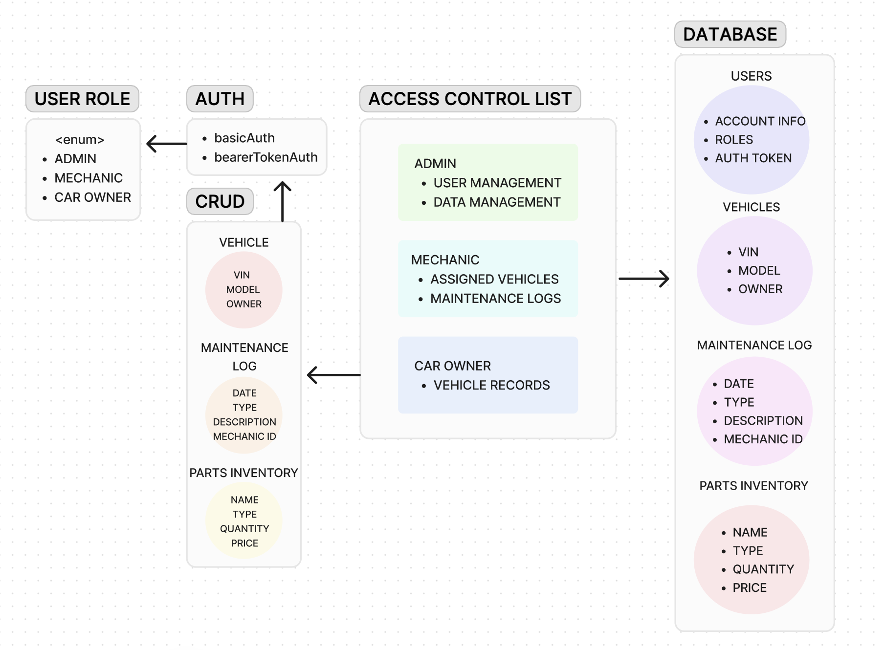

# Vehicle Maintenance Application
Vehicle Maintenance App that utilizes CRUD methods, ACL, Authentication, and SQL tables.

# Project Overview  
#### Author: Evan Cheng, Wajiha Khan & Jed Staley
#### Version: 1.0.0
---

## Introduction

This project aims to develop a comprehensive vehicle maintenance management system to streamline vehicle records, maintenance logs, and parts inventory for automotive service centers. The system will support multiple user roles including Admin, Mechanic, and Car Owner, each with specific functionalities and access levels.

---

## Application Diagram

---  

## Key Features

1. **Authentication:**
   - Basic Authentication for initial account creation.
   - Bearer Token Authentication for securing subsequent API calls.

2. **CRUD Operations:**
   - **Vehicles:**
     - Admins and Car Owners can add new vehicles and update their details.
     - Mechanics and Owners can view a vehicle's maintenance history.
   - **Maintenance Logs:**
     - Mechanics can add service records to a vehicle's maintenance log.
     - Admins can review all service logs for quality control.
   - **Parts Inventory:**
     - Mechanics and Admins can add, update, and remove parts from the inventory.
     - Admins can manage pricing and availability.

3. **Access Control List (ACL):**
   - Admins have full control over user and data management.
   - Mechanics access only their assigned vehicles and maintenance logs.
   - Car Owners can only see and modify their own vehicle records.

---

## Dependencies

- Node.js
- Express.js
- MongoDB
- JSON Web Tokens (JWT) for authentication
- Mongoose for database modeling

---

## Security

- Basic authentication for initial account creation ensures secure user registration.
- Bearer token authentication is implemented to secure subsequent API calls.
- Access control lists are enforced to restrict user access based on their roles.

---

## Database Design

- **Tables:**
  1. Users: Store user account information, roles, and authentication tokens.
  2. Vehicles: Hold vehicle data including VIN, model, and owner information.
  3. Maintenance Logs: Record service history for vehicles (date, type, description, mechanic ID).
  4. Parts Inventory: Maintain details of parts available for repairs (name, type, quantity, price).

---

## Endpoints

1. `/vehicles` - For adding/viewing vehicles.
2. `/vehicles/:id/logs` - For managing specific vehicle logs.
3. `/logs/:id` - For updating/removing logs.
4. `/inventory` - For managing parts.

---

## Getting Started

To set up the project locally:

1. Clone the repository.
2. Install dependencies using `npm install`.
3. Set up the postgresQL database.
4. Configure environment variables.
5. Run the application using `npm start`.

---

## Contribution Guidelines

Contributions to the project are welcome! Please follow the established coding conventions and guidelines. Submit a pull request for review and approval.

---

## License

This project is licensed under the [MIT License](./LICENSE).

---

## Acknowledgements

Special thanks to all contributors and open-source projects that made this endeavor possible.
